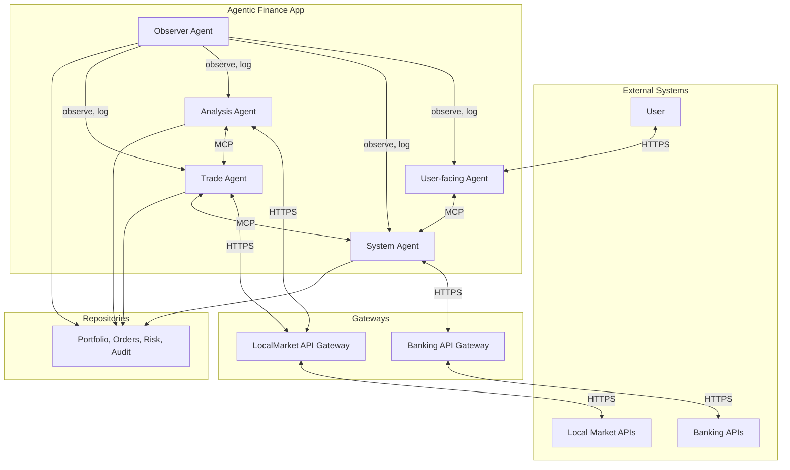

# Architecture — v1.0.0

**Version:** 1.0.0  
**FRS reference:** [FRS v1.0.1](../frs/FRS-v1.0.1.md)  
**Owner:** Architecture Agent  
**Status:** Draft for User and PM approval  

---

## 1. Overview

This document defines the system architecture for the Agentic Finance investing system v1. Scope is **Local Market only** (Crypto out of scope). Cloud provider is **AWS**; primary external protocol is **HTTPS**; A2A/tools use **MCP**; runtime is **event-driven (Spring)**.

---

## 2. High-level system context

---

## 3. Architectural components

| Component | Responsibility | Protocol / tech |
|-----------|----------------|-----------------|
| **Application** | Multi-agent Spring app (User-facing, System, Analysis, Trade, Observer) | Java, Spring AI, event-driven |
| **LocalMarket API Gateway** | Adapter to Local Market APIs; market data and order execution | HTTPS |
| **Banking API Gateway** | Adapter to Banking APIs; deposits and withdrawals | HTTPS |
| **Repositories** | Persistence for portfolio, orders, risk, audit logs | AWS RDS or equivalent |

---

## 4. Agent specifications

### 4.1 User-facing agent

| Attribute | Value |
|-----------|-------|
| **Inputs** | User queries; status from System/Analysis/Trade agents (via MCP/events); Observer alerts on hallucination risk |
| **Outputs** | Human-readable status, portfolio summary, alerts; filtered, non-hallucinated content |
| **MCP / A2A** | MCP for receiving verified status from other agents; no direct market or bank calls |

### 4.2 System agent

| Attribute | Value |
|-----------|-------|
| **Inputs** | Capital state from Repositories; withdrawal requests (user-defined schedule); risk/constraint rules from FRS |
| **Outputs** | Bank withdrawal instructions via Banking API Gateway; enforcement signals to Trade agent (capital preservation) |
| **MCP / A2A** | MCP to Trade agent for constraint enforcement; MCP to User-facing for status |

### 4.3 Analysis agent

| Attribute | Value |
|-----------|-------|
| **Inputs** | Market data from LocalMarket API Gateway; portfolio and risk state from Repositories |
| **Outputs** | Risk metrics (VaR 90%, CVaR 99%); strategy inputs; no trade orders |
| **MCP / A2A** | MCP to Trade agent for analysis outputs; events for market data consumption |

### 4.4 Trade agent

| Attribute | Value |
|-----------|-------|
| **Inputs** | Analysis agent outputs; capital and withdrawal constraints from System agent; market data |
| **Outputs** | Buy/sell orders via LocalMarket API Gateway; portfolio updates to Repositories |
| **MCP / A2A** | MCP from Analysis and System; MCP to User-facing for trade status |
| **Latency target** | ≤ 1000 ms end-to-end for trade execution path (per FRS §3) |

### 4.5 Observer agent

| Attribute | Value |
|-----------|-------|
| **Inputs** | Reasoning traces from all agents; prompts and MCP context |
| **Outputs** | Audit logs; hallucination tuning signals; prompt/MCP improvement suggestions |
| **MCP / A2A** | Observes A2A traffic; writes to Repositories (audit) |

---

## 5. Data flows (event-driven)

1. **Market events** → LocalMarket API Gateway → Analysis agent → Trade agent (strategy inputs).
2. **Trade execution** → Trade agent → LocalMarket API Gateway → Repositories (portfolio update).
3. **Withdrawal** → System agent → Banking API Gateway → Repositories (audit).
4. **User query** → User-facing agent → MCP/events from other agents → filtered response to User.
5. **Observer** → Observes all agent reasoning → Logs to Repositories; feeds tuning into prompt/MCP context.

---

## 6. Security and protocols

| Layer | Choice | Reference |
|-------|--------|-----------|
| **External APIs** | HTTPS (TLS) | FRS §2 |
| **A2A / tools** | MCP | FRS §2 |
| **Secrets** | AWS Secrets Manager | FRS §8 |
| **Auth** | To be defined per gateway (e.g. API keys, OAuth) | Architecture to detail in next iteration |

---

## 7. Deployment (AWS)

| Element | Choice |
|---------|--------|
| **Cloud** | AWS |
| **Compute** | ECS/EKS or Lambda + API Gateway (to be finalised) |
| **Database** | RDS (PostgreSQL or equivalent) for Repositories |
| **Monitoring** | Inbuilt AWS dashboards (CloudWatch, X-Ray) |
| **Regions** | Single region for v1; multi-region deferred |

---

## 8. Out of scope for v1

- Crypto market and Crypto API gateway.
- Multi-region deployment.
- GCP or hybrid cloud.

---

## 9. Next steps (Architecture Agent)

- Detail C4 Level 2/3 diagrams (containers, components).
- Define API contracts for LocalMarket and Banking gateways.
- Specify event schema and MCP tool definitions.
- Align with PM and User for approval.

---

*End of Architecture v1.0.0*
