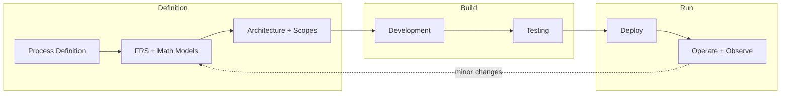

# Investing System Process Plan

## Context

- **Goal:** Build an investing system for Local Market (v1), developed via AI–User collaboration with final user approval, operated on Cursor by a multi-agentic dev team. Post-production focus: observe and refactor (minimal-impact improvements). Crypto out of scope for v1.
- **Stack:** Java, Spring AI; cloud provider and protocols per FRS v1 (exact choice with justification); App + LocalMarket API gateway + Banking API gateway + Repositories; event-driven.
- **App agents:** User-facing, System, Analysis, Trade, Observer. **Dev team agents:** Architecture (lead), Project Manager, Developers, Testing, DevSecOps.
- **Workspace:** [agentic-finance](.) is currently empty; process starts from scratch.

---

## High-Level Process Flow

- **Gates:** Each phase ends with a **validation checkpoint** and **user approval** where specified. Architecture and Project Manager agents own alignment; User gives final approval on FRS and major releases.

---

## Phase 1: Process and Governance Definition

**Owner:** Architecture (lead) + Project Manager (with User input).

**Deliverables:**

- **Process document:** Who does what (User vs AI vs each agent role); approval points; how FRS/architecture versions are the single source of truth; how “minor changes” post-production are proposed and approved.
- **Governance:** How Cursor agents are assigned (e.g., Architecture = rules/docs, PM = backlog, Dev = features, Test = QA, DevSecOps = deploy/ops); how Observer and red-team/hallucination checks fit in.
- **Validation stats (Phase 1):**
  - Process doc approved by User.
  - Role-to-agent mapping documented and agreed.
  - At least one explicit “User final approval” gate defined (e.g., before FRS freeze, before first production deploy).

---

## Phase 2: FRS and Mathematical Constraints

**Owner:** Project Manager (requirements) + Architecture (technical and math formulation).

**Deliverables:**

- **FRS (Functional Requirements Specification):** Agent-friendly format (e.g., structured sections: User-facing, System, Analysis, Trade, Observer; gateways; banking; withdrawals; edge-cases). Non-functional: security, scalability, observability.
- **Mathematical models/equations** for the six constraints:
  - **Human-friendly version:** Presented in FRS for User approval (plain language, readable notation, examples). This is the version that goes to the User.
  - **Agent-friendly version:** Kept in a team reference appendix (formal notation, machine-readable). Used by Architecture, Developer, and Observer agents.
  - **Mapping:** Both versions must be traceable; human-friendly text maps 1:1 to agent-friendly formulation.

| #   | Constraint             | Human-friendly (FRS approval)                                                                      | Agent-friendly (team reference)                             |
| --- | ---------------------- | -------------------------------------------------------------------------------------------------- | ----------------------------------------------------------- |
| 1   | Capital preservation   | Total capital at any time must never drop below initial capital plus all deposits                  | C(t) \geq C_0 + \sum D_i                                    |
| 2   | Compounding strategies | Growth compounds over time; strategy type (continuous or discrete) and params may differ by market | Continuous vs discrete; params by market                    |
| 3   | ROI over time          | ROI grows initially, then levels off toward a stable value relative to total market size           | \text{ROI}(t) \to \bar{R} as t \to \infty                   |
| 4   | User withdrawals       | Withdrawal schedule and caps; remaining capital still meets capital preservation rule              | Withdrawal caps; invariant: (1) holds after each withdrawal |
| 5   | Edge-cases             | VaR/CVaR limits, whale/shark rules, hallucination detection, red-team criteria                     | VaR/CVaR; whale/shark; hallucination; red-team              |
| 6   | Cost vs ROI            | Deployment and maintenance cost must be negligible compared to ROI                                 | \text{DeployCost} + \text{MaintenanceCost} \ll \text{ROI}   |

- **FRS v1 scope:** **Local-only** (Local Market). Crypto is out of scope for v1.
- **FRS v1 dual options:** FRS v1 must resolve all dual options with an exact choice and justification (e.g., AWS vs GCP, HTTPS vs MCP for each use case). No "and/or" left open.
- **FRS v1 numeric targets:** All validation values must be defined in FRS v1 for User approval (e.g., test coverage %, VaR/CVaR limits, max deployment cost as % of ROI).
- **Validation stats (Phase 2):**
  - FRS reviewed by Architecture and Project Manager.
  - All six constraints have human-friendly formulation for FRS approval and agent-friendly formulation in team appendix.
  - All dual options resolved with exact choice and justification in FRS v1.
  - All numeric validation targets defined in FRS v1 for User approval.
  - User final approval on FRS (and math) before architecture detail design.

---

## Phase 3: Architecture and Technical Scopes

**Owner:** Architecture (design, docs) + Project Manager (scope, backlog).

**Deliverables:**

- **System architecture:** App, LocalMarket API gateway (v1), Banking API gateway, Repositories; data flows; agent-to-agent and MCP boundaries; event-driven flows. (Crypto gateway out of scope for v1.)
- **Agent specs:** Responsibilities, inputs/outputs, and prompts/MCP context for User-facing, System, Analysis, Trade, Observer; how Observer minimizes hallucinations (logging, tuning).
- **Security and protocols:** Exact choice from FRS v1 (HTTPS vs MCP per use case); where MCP is used (e.g., tool exposure, A2A); realtime/event topology.
- **Deployment view:** Exact choice from FRS v1 (AWS or GCP) with justification; regions; inbuilt cloud dashboards for monitoring.
- **Technical and non-technical scope:** FRS v1 scope is Local-only; in/out of v1; which strategies in v1.
- **Validation stats (Phase 3):**
  - Architecture doc and diagrams (e.g., C4 or similar) in repo.
  - All five app agents have a clear contract/spec.
  - Scope agreed with User (PM + Architecture).
  - Security and protocol choices documented and justified.

---

## Phase 4: Development (Agile, Multi-Agentic)

**Owner:** Project Manager (sprints, backlog) + Developer agents (implementation).

**Deliverables:**

- **Codebase:** Java, Spring AI; gateways; repositories; agent implementations; MCP integration; strategy and math hooks (capital rules, compounding, ROI, withdrawals).
- **FRS traceability:** Features and components mapped to FRS v1 sections; later versions of FRS for minor changes kept as single source of truth. FRS v1 defines exact options (e.g., cloud provider, protocols) and numeric targets.
- **Validation stats (Phase 4):**
  - All FRS v1 items either implemented or explicitly deferred with reason.
  - Code follows Architecture (gateways, agents, repos); no bypass of capital/withdrawal rules.
  - Definition of Done per story (e.g., unit tests, no critical lints).

---

## Phase 5: Testing (QA, Regression, Performance, Security, Observability)

**Owner:** Testing agents + DevSecOps (ops/observability).

**Deliverables:**

- **QA and regression:** Test plans and suites; pass criteria.
- **Performance:** Load/latency targets; benchmarks for critical paths (e.g., trade execution, API gateways).
- **Security and penetration:** Red-team/hacking scenarios; VaR/CVaR and edge-case tests (whale/shark, failure injection).
- **Observability:** Logging, metrics, alerts; Observer agent logs and tuning inputs.
- **Validation stats (Phase 5):**
  - Test pass rate and coverage thresholds met per FRS v1 (e.g., test coverage %, VaR/CVaR limits).
  - No open critical/high security or capital-safety defects.
  - Performance and observability sign-off by DevSecOps and Architecture.

---

## Phase 6: Deploy and Go-Live

**Owner:** DevSecOps + Architecture.

**Deliverables:**

- **Deployment:** Cloud provider per FRS v1 (AWS or GCP); pipelines; environments; inbuilt cloud dashboards wired.
- **Runbooks and rollback:** Operational procedures; cost checks (constraint 6).
- **Validation stats (Phase 6):**
  - Successful production deployment.
  - Monitoring and alerts active; deployment/maintenance cost documented and acceptable vs ROI.

---

## Phase 7: Operate, Observe, and Refactor

**Owner:** DevSecOps + Observer (and Architecture for structural refactors).

**Deliverables:**

- **Ongoing:** Monitor dashboards; respond to alerts; run Observer outputs (reasoning logs, hallucination tuning).
- **Minor changes:** Optimizations and refactors planned via small FRS updates (single source of truth); zero or minimal impact; user approval as per process.
- **Validation stats (Phase 7):**
  - No violation of capital preservation (constraint 1); withdrawals within rules (constraint 4).
  - Incidents and refactors documented; FRS/architecture docs updated for subsequent versions.

---

## Suggested Validation Stats Summary

| Phase | Key validation metrics                                    |
| ----- | --------------------------------------------------------- |
| 1     | Process and role approval; User gate defined              |
| 2     | FRS + 6 math constraints defined; User approval           |
| 3     | Architecture and agent specs documented; scope agreed     |
| 4     | FRS traceability; Architecture compliance; DoD            |
| 5     | Pass rate, coverage, security, performance, observability |
| 6     | Deploy success; monitoring; cost vs ROI                   |
| 7     | Capital/withdrawal invariants; FRS/versioning for changes |

---

## Communication to PM Agent

**Owner:** Project Manager Agent.

The following requirements and todos are directed to the PM Agent for FRS v1 and Phase 2–3 alignment:

1. **Equations format:**
  - Present mathematical constraints in **human-friendly** form in the FRS for User approval (plain language, readable notation, examples).
  - Maintain **agent-friendly** versions in a team reference appendix for Architecture, Developer, and Observer agents.
  - Ensure 1:1 traceability between human-friendly and agent-friendly formulations.
2. **FRS v1 dual options:**
  - Resolve all dual options with an **exact choice and justification** (e.g., AWS vs GCP, HTTPS vs MCP per use case).
  - No "and/or" left open; every dual option must have a single selected option with rationale.
3. **FRS v1 numeric targets:**
  - Define **all** numeric validation targets in FRS v1 for User approval: test coverage %, VaR/CVaR limits, max deployment cost as % of ROI, and any other thresholds referenced in validation stats.
4. **FRS v1 scope:**
  - **Local-only.** Local Market is in scope for v1; Crypto is out of scope.

**PM Agent todos:** See frontmatter todos `todo-pm-agent-equations`, `todo-pm-agent-dual-options`, `todo-pm-agent-numeric-values`, `todo-pm-agent-scope`.

---

## How You Can Guide the Path

- **Next step options:** (1) Lock Phase 1 process doc and governance in this repo, or (2) Draft the FRS v1 skeleton and the six mathematical constraints (Phase 2), or (3) Define the first version of system architecture and agent contracts (Phase 3). Tell me which you want to do first and I’ll align the next plan to that.
- **Scope (decided):** v1 is **Local-only**. Local Market API gateway is in scope; Crypto gateway is out.
- **Validation targets:** All numeric values (coverage %, VaR/CVaR, max deployment cost as % of ROI) must be defined in FRS v1 for User approval before Phase 3.

Once you choose the next step, the next iteration can produce concrete artifacts (e.g., `docs/process.md`, `docs/frs.md`, `docs/architecture.md`) ready for your approval.